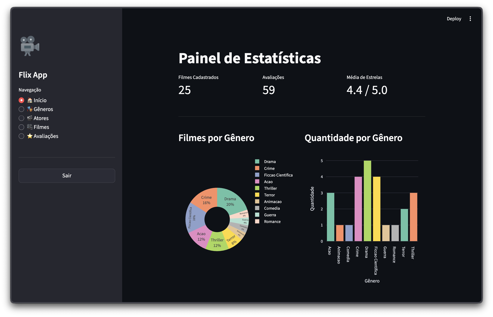
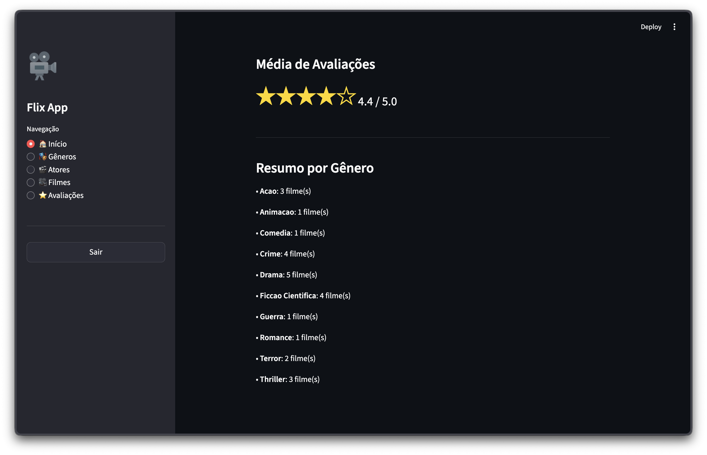
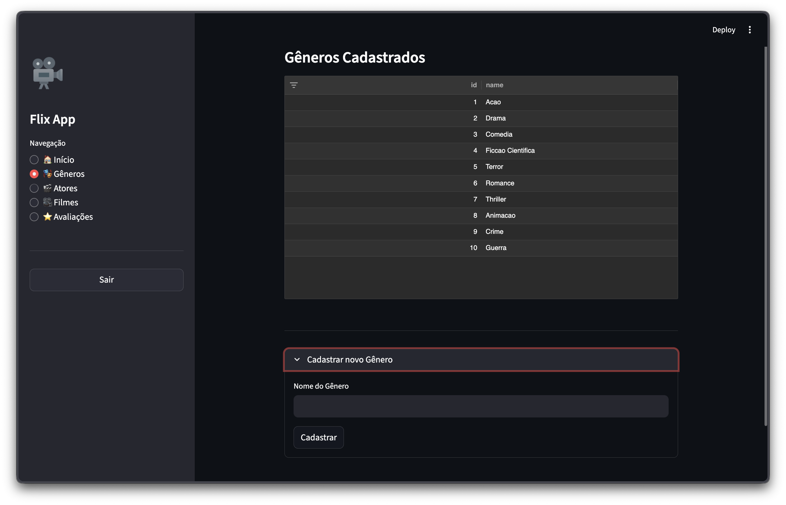
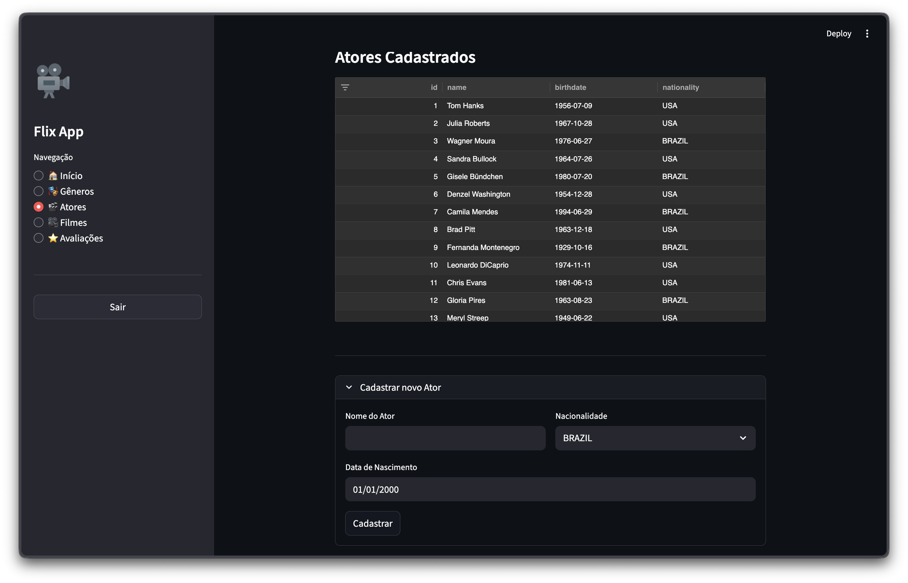
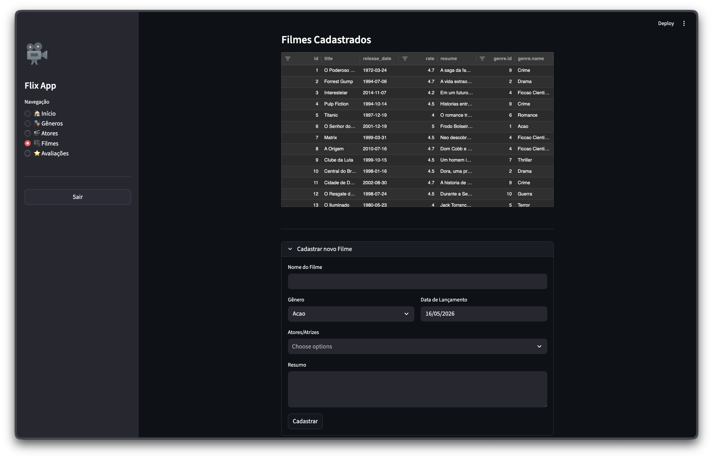
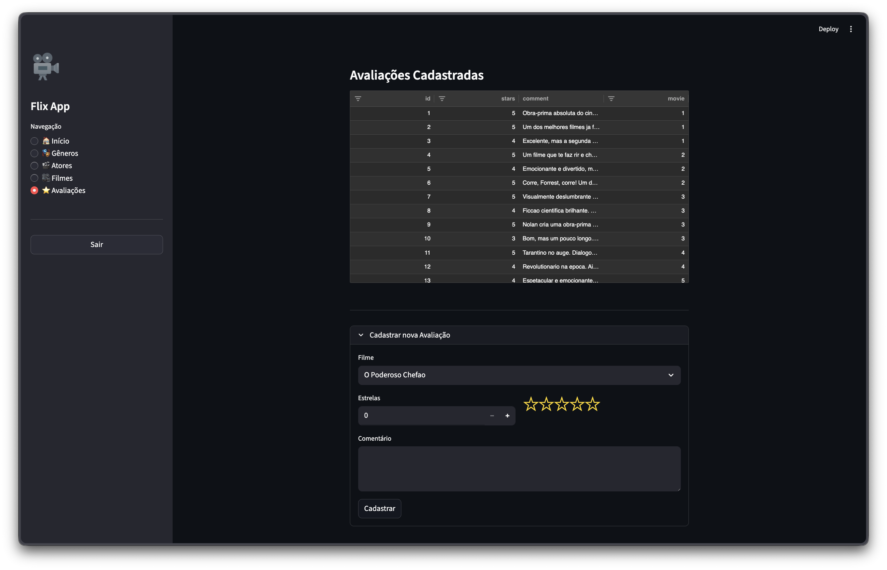

# Flix App

Aplicacao web para gerenciamento de filmes, atores, generos e avaliacoes, construida com Streamlit e integrada a uma API REST externa com autenticacao JWT.

## Visao Geral

O Flix App e um front-end construido em Python com Streamlit que consome a [Flix_API](https://github.com/marcosilvaa/flix_api) — uma API REST local em `http://localhost:8000/api/v1/`. A aplicacao permite:

- Listar e cadastrar generos, atores, filmes e avaliacoes
- Visualizar estatisticas de filmes (graficos com Plotly)
- Gerenciar autenticacao via JWT

## Execucao

```bash
uv sync                              # instalar dependencias
uv run streamlit run app.py          # iniciar a aplicacao
uv run flake8 .                      # lint (ignora E501, exclui .venv)
```

Requer Python >=3.14. Nao ha test suite nem CI.

## Telas

### Inicio — Dashboard

Dashboard com metricas de filmes, graficos de distribuicao por genero (rosca e barras), media de avaliacoes com estrelas visuais e resumo por genero.





### Generos

Listagem de generos em tabela interativa (AgGrid) com formulario de cadastro em expander collapsavel. Valida nome vazio e nome duplicado.



### Atores

Listagem de atores em AgGrid com formulario de cadastro em expander. Campos para nome, data de nascimento e nacionalidade (dropdown).



### Filmes

Listagem de filmes em AgGrid (coluna `actors` removida para legibilidade). Formulario em expander com selecao de genero (dropdown), atores (multiselect), data de lancamento e resumo.



### Avaliacoes

Listagem de avaliacoes em AgGrid. Formulario em expander com selecao de filme, estrelas (0-5 com visualizacao em estrelas) e comentario.



## Estrutura do Projeto

```
flix_app/
├── app.py                # Ponto de entrada da aplicacao
├── main.py               # Stub obsoleto (nao usar)
├── pyproject.toml        # Dependencias e configuracao do projeto
├── config.toml           # Configuracao da aplicacao (titulo)
├── .flake8               # Configuracao do linter
├── .python-version        # Versao do Python (3.14)
├── api/                   # Autenticacao JWT (Auth class)
├── login/                 # Tela e logica de login/logout
├── home/                  # Dashboard com estatisticas de filmes
├── genres/               # Modulo de generos (CRUD completo)
├── actors/               # Modulo de atores (CRUD completo)
├── movies/               # Modulo de filmes (CRUD + stats)
├── reviews/              # Modulo de avaliacoes (CRUD completo)
└── docs/                 # Documentacao do projeto
```

Para detalhes de cada modulo, arquitetura e convencoes, consulte a documentacao em `docs/`.

## Documentacao

| Arquivo | Conteudo |
|---------|----------|
| [Estrutura do Projeto](docs/estrutura_projeto.md) | Organizacao de arquivos e pastas |
| [Arquitetura](docs/arquitetura.md) | Padrao em camadas (page/service/repository) |
| [Padroes de Codigo](docs/padroes_codigo.md) | Convencoes de nomenclatura e estilo |
| [Tecnologias](docs/tecnologias.md) | Dependencias e ferramentas |
| [Modulo API](docs/api.md) | Servico de autenticacao JWT |
| [Modulo Login](docs/login.md) | Fluxo de login e logout |
| [Modulo Home](docs/home.md) | Dashboard de estatisticas |
| [Modulo Generos](docs/genres.md) | CRUD de generos |
| [Modulo Atores](docs/actors.md) | CRUD de atores |
| [Modulo Filmes](docs/movies.md) | CRUD de filmes e integracoes |
| [Modulo Avaliacoes](docs/reviews.md) | CRUD de avaliacoes |

## Stack

- **Python 3.14** com **Streamlit** (front-end e servidor)
- **uv** para gerenciamento de pacotes
- **requests** para chamadas HTTP a API externa
- **streamlit-aggrid** para tabelas interativas
- **plotly** para graficos (dashboard Home)
- **pandas** para normalizacao de dados

## Limitacoes Conhecidas

- `main.py` e um stub obsoleto; o entry point real e `app.py`
- `movies/services.py` usa nome plural (diferente dos demais modulos que usam `service.py`)
- `genres/page.py` tem bug: `g['name'].lower` sem parenteses (linha 30) — deveria ser `.lower()`
- A aplicacao depende da Flix_API local e nao funciona offline
- Nao ha banco de dados local; todos os dados vem da Flix_API
- `config.toml` so contem `app_title` e nao e lido pelo codigo da aplicacao